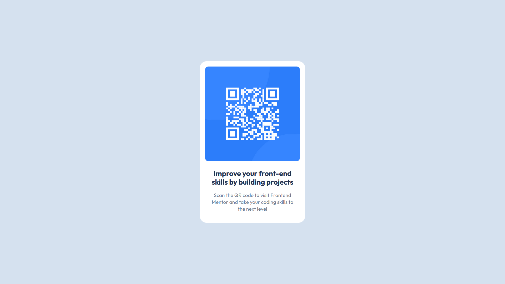

# Frontend Mentor - QR code component solution

This is a solution to the [QR code component challenge on Frontend Mentor](https://www.frontendmentor.io/challenges/qr-code-component-iux_sIO_H). Frontend Mentor challenges help you improve your coding skills by building realistic projects. 

## Table of contents

- [Overview](#overview)
  - [Screenshot](#screenshot)
  - [Links](#links)
- [My process](#my-process)
  - [Built with](#built-with)
  - [What I learned](#what-i-learned)
  - [Continued development](#continued-development)
  - [Useful resources](#useful-resources)
- [Author](#author)
- [Acknowledgments](#acknowledgments)

**Note: Delete this note and update the table of contents based on what sections you keep.**

## Overview

### Screenshot



### Links

- Solution URL: [Frontend Mentor](https://www.frontendmentor.io/solutions/more-responsive-qr-code-card-5ewlbfIm_V)
- Live Site URL: [GitHub Pages](https://shwerts.github.io/qr-code-component__2/)

## My process

### Built with

- Semantic HTML5 markup
- CSS custom properties
- Flexbox

### What I learned

Using responsive units like `rem` to collaborate with user and user agent's font settings

For example, setting font size for heading and text:
```
.heading {
  font-size: 1.37rem;
  ...
}
.text {
  ...
  font-size: calc(1rem - 1px);
}
```

## Author

- Frontend Mentor - [@shwerts](https://www.frontendmentor.io/profile/shwerts)

## Acknowledgments

Even now I still need feedbacks from anyone, who can help me to improve my frontend skill
